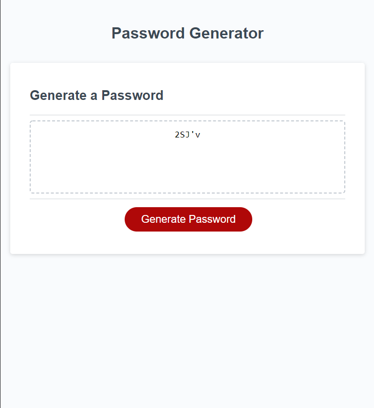

# Javascript Challenge: Password Generator

## This challenge I had to create an application that can generate a random password. 
## Users are prompted to to select the number/length of characters. 
## Users also have the options to include lowercase letters, uppercase letters, numbers, and special characters. 

# Deployable Link
https://mlmcdan1.github.io/PasswordGenerator/
